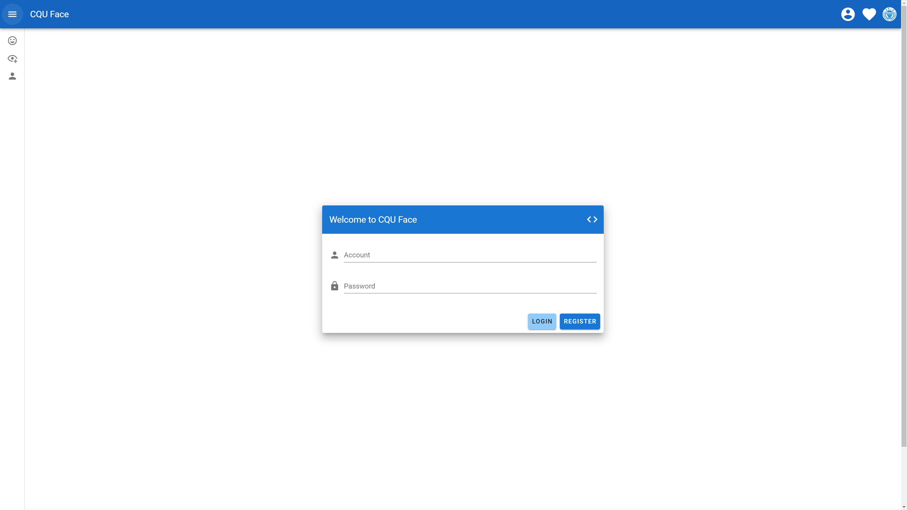
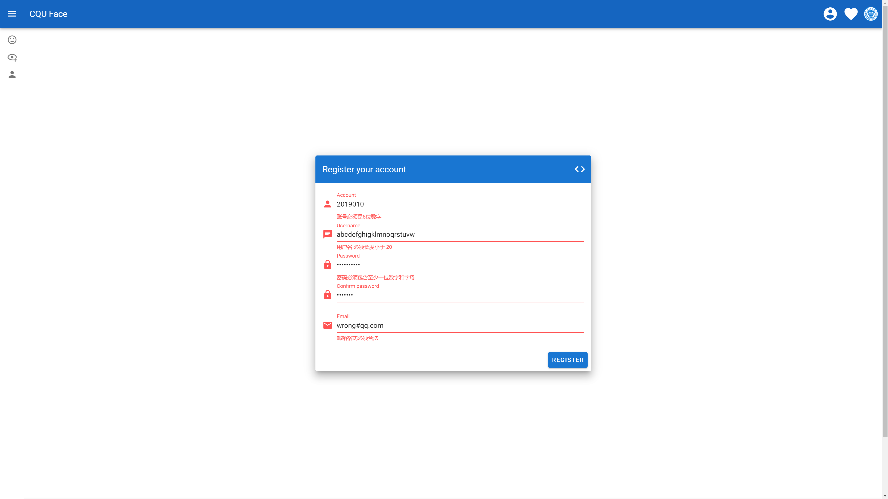
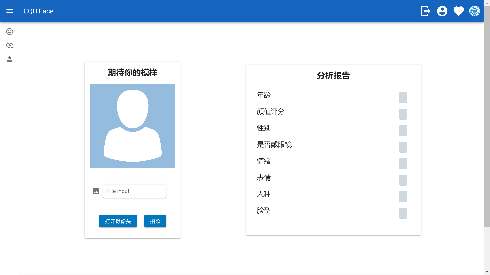
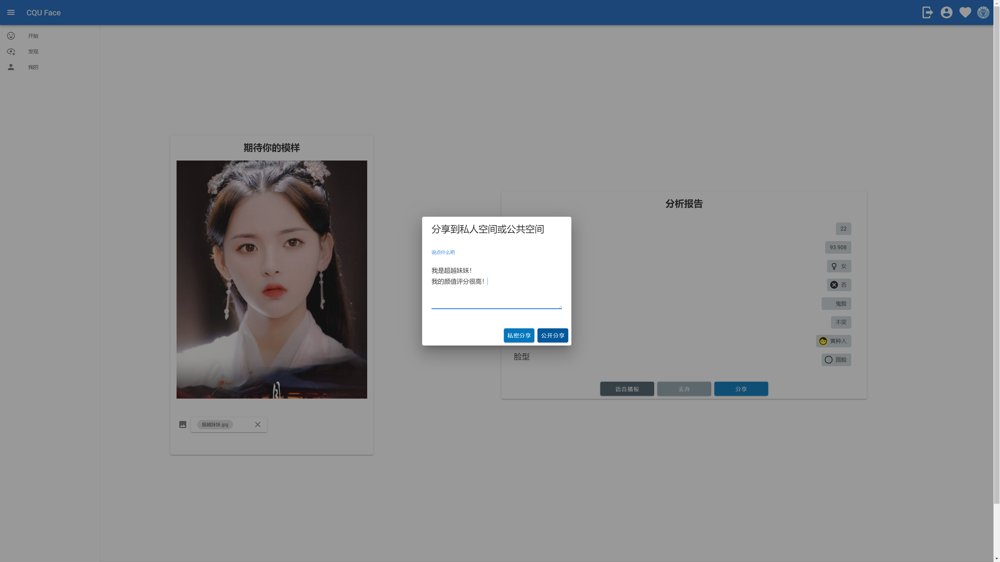
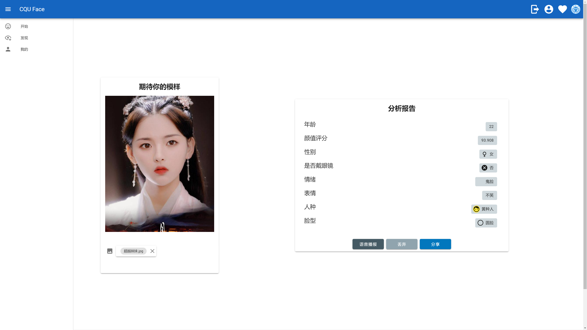
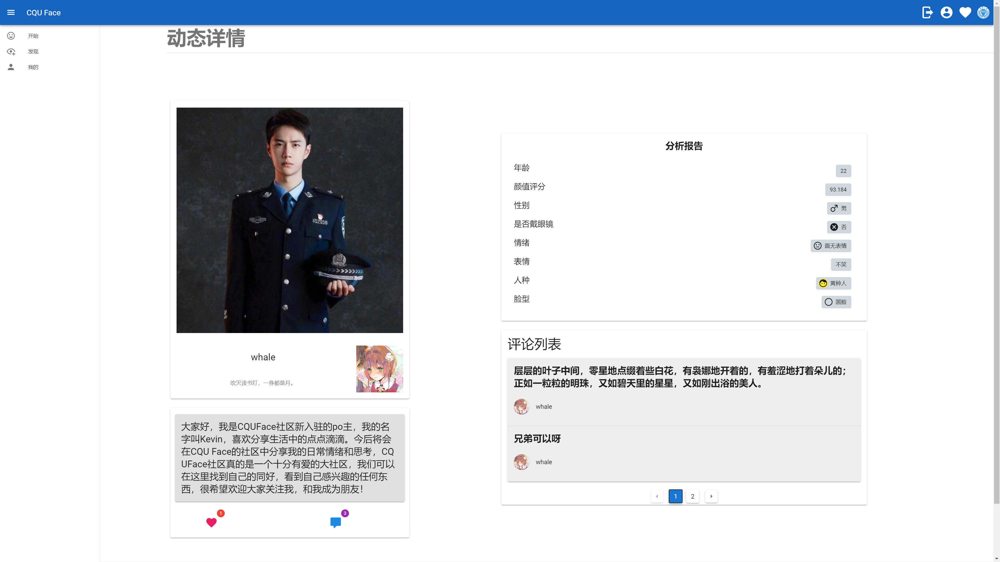
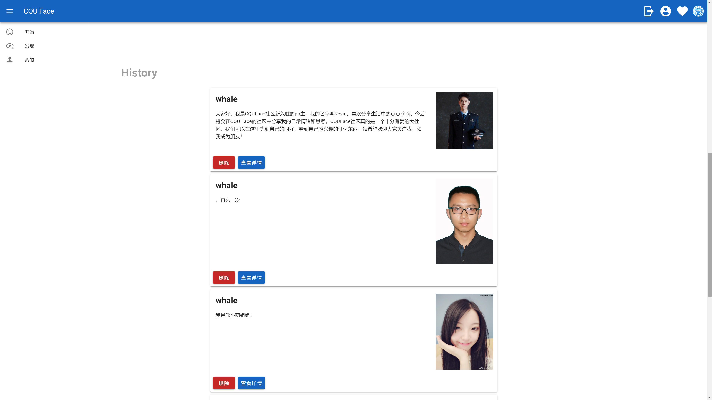
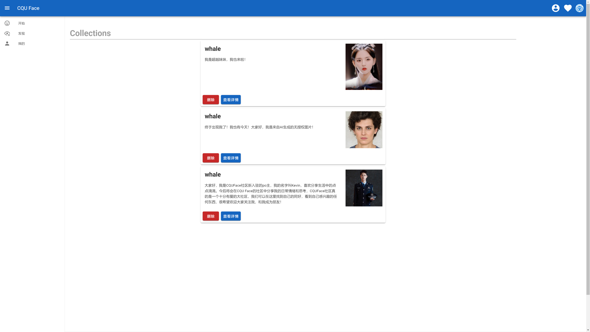
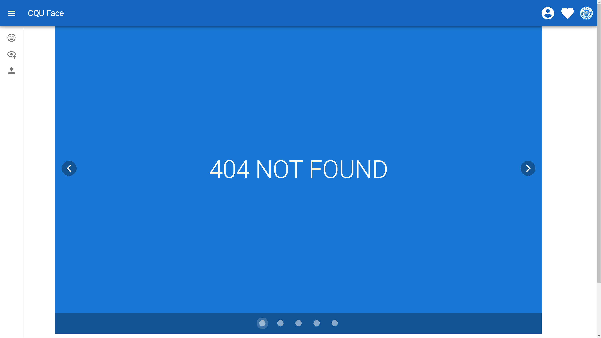

# CQU-FACE

## 前端技术

## 技术栈

- Vue.js
- vue/cli (多页面)
- vue-router
- vuetify
- axios

### 权限控制

分为前端路由控制和后端令牌验证

- 通过vue-router导航守卫，使用router.beforeEach来检查路由跳转条件。

  判断是否需要登录

  - 是，从localStorage中拿到account
    - 如果拿到account则可以跳转
    - 否则重定向到登录页，并记录当前路由，登录后跳转回来
  - 否，可以跳转

- 通过Axios拦截器Interceptors进行全局的ajax请求配置

  - request：在Header中添加token字段
  - response：返回状态码405（自定义），表示未授权，跳转登录页。

### 处理跨域问题、CSRF问题

- 后端django-cors-headers配置解决跨域问题

- axios配置头Header添加X-CSRFToken，通过正则表达来从cookie中拿到csrftoken，进行验证

### 路由控制

- 由router-view控制路由，以及路由对应的视图。并配置404页面。

### 前端框架

- 使用vue/cli快速搭建前端工程，形成目录结构和必要文件
- 配置Vue多页面，welcome为单独页，应用页单独页
- 在App.vue中进行全局模板的配置，上方使用一个Bar，左侧使用抽屉导航栏，下方使用Footer页脚，中间部分为功能部件，使用<router-view>，由vue-router进行控制显示视图页面。

### 优点

- 组件化开发，封装常用的部分为单Vue组件，在其他页面引入，代码复用。
- API接口全部封装为函数，由单独的js文件进行管理，需要的页面中只需引入。
- 界面简洁，使用v-if条件渲染，位置重用，试图切换，避免一切不必要的显示。
- 注重用户交互，给予良好的操作提示。
- 响应式页面，注意屏幕尺寸适配。
- 提供了严格的表单数据校验。

## 个人分工

1. 前端、后端项目框架搭建
2. 前端的依赖配置、权限控制、路由控制、请求控制，异常处理
3. 前端页面实现
   - 欢迎页，模板页
   - 登录、注册模块
   - 头像处理、信息修改模块
   - 图片数据采集，分析报告显示、语音播报，分享
   - 历史分享管理
4. 后端异常处理
5. 整合所有前端模块，对接前后端模块，调试分析
6. 界面优化，用户交互优化

1. 前、后端项目框架搭建
2. 前端配置、权限、请求、路由控制
3. 前端页面实现欢迎页、模板页，登录注册、信息修改，数据采集显示、分享
4. 前端整合、后端对接、异常处理

## 前端实现逻辑

# 界面展示

